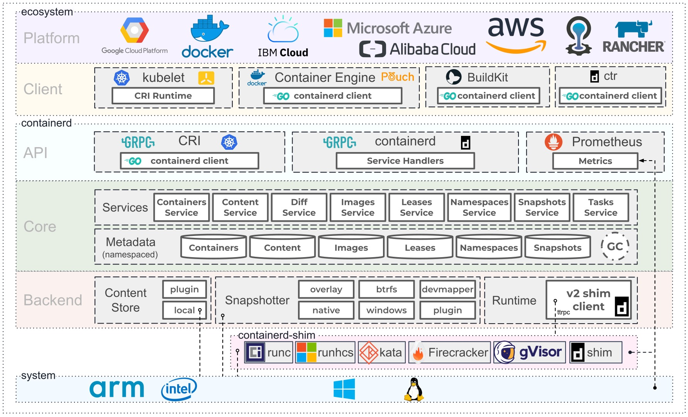
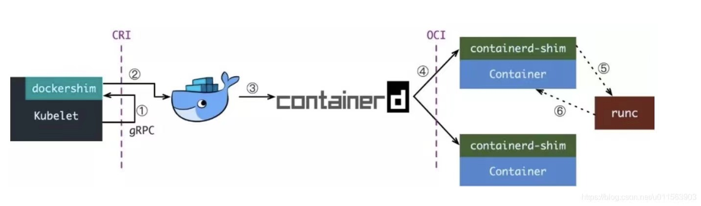

# Kubernates 常用命令

	kubectl get pods --all-namespaces -o wide
	kubectl get pods -n kube-system -o wide
	kubectl get pods -n kube-flannel  -o wide
	kubectl get nodes  -o wide
	
	kubectl get pod -n kubernetes-dashboard -o wide
	kubectl get svc  -n kubernetes-dashboard -o wide

	kubectl describe nodes k8s-node-01
	kubectl describe po kube-proxy-9x6fr -n kube-system
	
	kubectl get secret login-harbor --output=yaml
	
	kubectl get deployment -n kube-system -o wide
	kubectl delete deployment node-test-deployment -n kube-system

	kubectl scale --replicas=5 deployment/node-test-deployment -n kube-system

	kubectl expose --help

	kubectl expose deployment node-test-deployment --port=8081 --target-port=8080 -n kube-system

	kubectl get svc -n kube-system
	kubectl delete svc node-test-deployment -n kube-system

	kubectl edit svc node-test-deployment -n kube-system
	
	

# 查看node节点加入的 sha 和 node 加入集群
	kubeadm token create --print-join-command
	kubeadm join 192.168.50.61:6443 --cri-socket unix:///var/run/containerd/containerd.sock --token qr0dir.kfuer8ovhhyx6maa --discovery-token-ca-cert-hash sha256:28a80b14f648afe1b884efec0a4cf8131b41333e04c1252790c3e2997e9e85af  
	
	# 删除node
	kubectl drain k8s-node-01 --delete-emptydir-data
	kubectl delete node k8s-node-01
	
	# kubectl delete type typename
	
	# 重新加入，在node端操作
	rm -rf /etc/kubernetes/*
	rm -rf /var/lib/kubelet/*
	service containerd restart
	service kubelet restart
	
	kubeadm join 192.168.50.61:6443 .....
	
	
# 初始化和重置 kubeadm
	kubeadm init --cri-socket unix:///var/run/containerd/containerd.sock
	kubeadm reset
	
	# 导出默认初始化配置
	kubeadm config print init-defaults  > kubeadm-config.yaml
	kubeadm init --config=kubeadm-config.yaml

# Kubernates 1.24.3 安装
参考文献：   
https://kubernetes.io/zh-cn/docs/setup/production-environment/container-runtimes/     
https://blog.csdn.net/QW_sunny/article/details/123579157

1、安装 containerd，参考：https://github.com/containerd/containerd/blob/main/docs/getting-started.md
	
	需要安装：
		1、containerd official binaries， 
		2、Installing runc
		3、Installing CNI plugins    
		
	查看runtime-endpoint ：
	crictl --runtime-endpoint /run/containerd/containerd.sock ps
	
	修改：
	vim /etc/crictl.yaml
	runtime-endpoint: unix:///var/run/containerd/containerd.sock	
	image-endpoint: unix:///var/run/containerd/containerd.sock
	timeout: 10
	debug: true
   
2、转发 IPv4 并让 iptables 看到桥接流量

	通过运行 lsmod | grep br_netfilter 来验证 br_netfilter 模块是否已加载。
	若要显式加载此模块，请运行 sudo modprobe br_netfilter。
	为了让 Linux 节点的 iptables 能够正确查看桥接流量，请确认 sysctl 配置中的 net.bridge.bridge-nf-call-iptables 设置为 1。例如：
	
	cat <<EOF | sudo tee /etc/modules-load.d/k8s.conf
	overlay
	br_netfilter
	EOF

	sudo modprobe overlay
	sudo modprobe br_netfilter

	# 设置所需的 sysctl 参数，参数在重新启动后保持不变
	cat <<EOF | sudo tee /etc/sysctl.d/k8s.conf
	net.bridge.bridge-nf-call-iptables  = 1
	net.bridge.bridge-nf-call-ip6tables = 1
	net.ipv4.ip_forward                 = 1
	EOF

	# 应用 sysctl 参数而不重新启动
	sudo sysctl --system
	
3、将 k8s 的 cgroupDriver设置为systemd，需编辑 KubeletConfiguration 的 cgroupDriver 选项，并将其设置为 systemd。例如：
	
	# 在版本 1.22 中，如果用户没有在 KubeletConfiguration 中设置 cgroupDriver 字段， kubeadm init 会将它设置为默认值 systemd。

	# 修改
	apiVersion: kubelet.config.k8s.io/v1beta1
	kind: KubeletConfiguration
	...
	cgroupDriver: systemd
	

	
4、将 systemd 配置为容器运行时（containerd）的 cgroup 驱动。  
	
	# 生成config.toml
	mkdir -p /etc/containerd
	containerd config default | tee /etc/containerd/config.toml
	
	# 修改
	vim /etc/containerd/config.toml
	[plugins."io.containerd.grpc.v1.cri".containerd.runtimes.runc]
	  ...
	  [plugins."io.containerd.grpc.v1.cri".containerd.runtimes.runc.options]
	    SystemdCgroup = true

5、安装 kubeadm、kubelet 和 kubectl

	sudo apt-get update
	sudo apt-get install -y apt-transport-https ca-certificates curl
	sudo curl -fsSLo /usr/share/keyrings/kubernetes-archive-keyring.gpg https://packages.cloud.google.com/apt/doc/apt-key.gpg
	echo "deb [signed-by=/usr/share/keyrings/kubernetes-archive-keyring.gpg] https://apt.kubernetes.io/ kubernetes-xenial main" | sudo tee /etc/apt/sources.list.d/kubernetes.list
	
	apt-get update
	apt-get install kubelet kubeadm kubectl
	apt-mark hold kubelet kubeadm kubectl
	
6、运行

	# export KUBECONFIG=/etc/kubernetes/admin.conf
	mkdir -p $HOME/.kube
	cp -i /etc/kubernetes/admin.conf $HOME/.kube/config
	chown $(id -u):$(id -g) $HOME/.kube/config

	kubeadm init --pod-network-cidr=10.244.0.0/16 --cri-socket unix:///var/run/containerd/containerd.sock
	
7、安装 flannel

	kubectl apply -f https://github.com/coreos/flannel/raw/master/Documentation/kube-flannel.yml

	kubectl get pod -n kube-flannel -o wide
---

## Master端自动重启脚本

	#!/bin/bash

	kubeadm reset

	service kubelet stop

	# rm /etc/kubernetes/manifests/kube-controller-manager.yaml
	# rm /etc/kubernetes/manifests/kube-scheduler.yaml 
	# rm /etc/kubernetes/manifests/etcd.yaml
	# rm /etc/kubernetes/manifests/kube-apiserver.yaml
	# rm -rf /var/lib/etcd

	kubeadm init --pod-network-cidr=10.244.0.0/16 --cri-socket unix:///var/run/containerd/containerd.sock

	# export KUBECONFIG=/etc/kubernetes/admin.conf
	rm -rf .kube
	mkdir -p $HOME/.kube
	cp -i /etc/kubernetes/admin.conf $HOME/.kube/config
	chown $(id -u):$(id -g) $HOME/.kube/config

	kubectl get nodes -n kube-system -o wide
	kubectl get pod -n kube-system -o wide

## Node 端重启脚本
	
	#!/bin/bash
	rm -rf /etc/kubernetes/*
	rm -rf /var/lib/kubelet/*
	service containerd restart
	service kubelet restart

	#kubeadm join 192.168.50.61:6443 .....

 - - -

# 私有仓部署
	kubectl create deployment node-test-deployment --image=hub.gigimed.cn:30002/k8s/k8sapp:v1 --port=80 --replicas=1 --namespace=kube-system

# 登入私有仓库
	kubectl create secret docker-registry login-harbor --docker-server=hub.gigimed.cn:30002 --docker-username=ison --docker-password=Ison1234 --namespace=kube-system --dry-run=client -o yaml > login-harbor.yaml
	# kubectl apply -f login-harbor.yaml
	kubectl create secret generic login-harbor --from-file=.dockerconfigjson=/root/.docker/config.json --type=kubernetes.io/dockerconfigjson --namespace=kube-system
	kubectl get secret login-harbor --output=yaml
	
	
